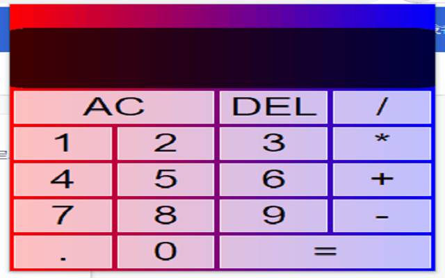

# 
 **Calculator Chrome Extension** 

## **Description**

 A simple calculator application in the form of chrome extension. It allows people to solve some math problem in daily life. An easy accessible program which only requires two mouse clicks to open it in chrome browser. 

## **How To Use**
1. Clone the github repository
2. open google chrome
3. Go to chrome extension management page
4. Turn on developer mode
5. Click add uncompressed chrome extension 
6. Find the github repository folder we just cloned on you hard drive and click select
7. Now you have a simple calculator in your chrome extension, enjoy!

**Calculator Screen**

 

## **Built With**
* JavaScript
* HTML
* CSS
* JSON

## **Contributors**
### Github:
* Sheng Da Chen: https://github.com/asd908433289

### LinkedIn:
* Sheng Da Chen: https://www.linkedin.com/in/sheng-chen-684014202/
